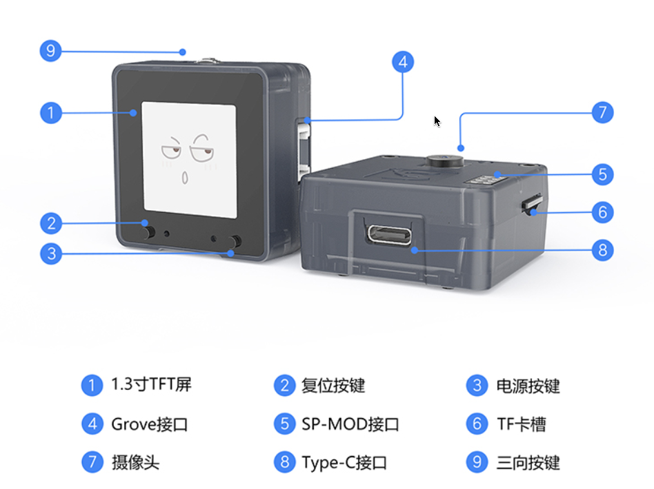
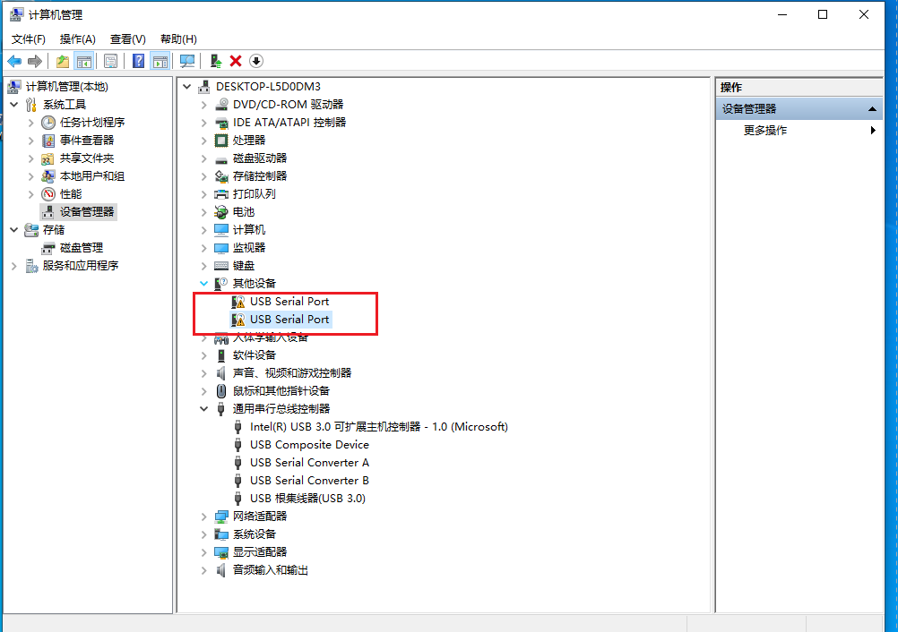

## Overview

  SIPEED **MaixCube** can develop programming learning kit, MaixCube integrates 30W camera, expandable TF card slot, user buttons, IPS 1.3 inch display, 200mAh lithium battery, speaker, microphone, SPMOD, GROVE expansion interface, etc. on the hardware.
  MaixCube is equipped with MaixPy by default on the software. Users can easily use MicroPython syntax to quickly get started with AI IoT development, develop face recognition, object recognition and other AI applications. At the same time, it also reserves development and debugging interfaces, which can also be used as a powerful AI learning development board.

## Appearance and function introduction

### Appearance list



### Onboard functions

| Project | Description |
| --- | --- |
| CPU: | Dual-core 64bit RISC-V / 400MHz (double precision FPU integration) |
| Memory: | 8MiB 64bit on-chip SRAM |
| Storage: | 16MiB Flash, support micro SDXC expansion storage (max 128GB) |
| Screen: | 1.3 inch **IPS** Screen: Resolution **240*240** |
| Camera: | Equipped with **0V7740** **30W** pixels **Sensor** |
| Buttons: | Reset button, power button (short press to turn on, long press *8S* to turn off), three-way button |
| USB: | Type-C interface, positive and negative blind plug |
| Audio: | Support audio recording, playback, driver IC (ES8374) |
| Onboard sensors: | Three-axis acceleration sensor (MSA301) |
| Lamp: | Two RGB LEDs on board |
| TF card slot: | Multimedia resource expansion, support large-capacity storage |
| Power management: | AXP173 control unit, 200mAh lithium battery, support user charge and discharge control |

### Pin Resources


### Onboard expansion interface

Maix Cube opens two highly expanded interfaces to users: one [SP-MOD](../modules/sp_mod/README.md) and one [Grove](./../modules/grove/README.md) Interface, users can easily DIY

### Onboard I2C device

MaixCube onboard I2C sensor/IC

| IC | Device id | I2C address (7-bit address) | Configuration: SCL: IO_30, SDA: IO_31 |
| --- | --- | --- | --- |
| --- | I2C Address | <<1 | MaixPy read address |
| ES8374 | 0x08 | 0x10 | D(16) |
| MSA301 | 0x13 | 0x26 | D(38) |
| AXP173 | 0x68 | 0x34 | D(52) |


## Get started

Because MaixCube comes with its own GUI demo interface and sample programs, you can play with the preset programs first when you get the board.
After that, we will start to use MaixCube to get started with AIoT with MaixPy.

Before development, we need to understand and prepare related tools to reduce the pitfalls we have to follow because of insufficient preparation.

Steps to get started:

1. Download the required drivers and software
2. Connect the development board to the computer and install the USB driver
3. Update the latest firmware
4. Download and open the latest MaixPy IDE
5. Connect MaixPy IDE to the development board Run MaixPy sample program

### Software and hardware preparation

Hardware preparation:

  - **Computer** one
  - **MaixCube** Development Board
  - One **reliable** USB Type-C data cable: pay attention to a **reliable** data cable

Software preparation:

  - USB driver: **FT2232** ->[[download link here](https://dl.sipeed.com/MAIX/tools/ftdi_vcp_driver)](https://dl.sipeed.com/MAIX/tools /ftdi_vcp_driver)
  - Kflash_gui: [https://dl.sipeed.com/MAIX/tools/kflash_gui](https://dl.sipeed.com/MAIX/tools/kflash_gui)
  - MaixPy IDE: [https://dl.sipeed.com/MAIX/MaixPy/ide/_/v0.2.5](https://dl.sipeed.com/MAIX/MaixPy/ide/_/v0.2.5)
  - Routine library: [https://github.com/sipeed/MaixPy_scripts](https://github.com/sipeed/MaixPy_scripts)

###  install driver

When we get the Maix Cube and connect to the computer, we can open the device manager to check whether the serial port driver has been installed. The methods to open the device manager are:
- This computer (right click) -> Properties -> Device Manager
- Start menu (right click) -> Device Manager
- Control Panel -> (Search) Device Manager

  

1. When our system is a Win10 system, the system will automatically install the driver for us, and if it is an old version of Win7, win8, we need to install it manually:
    

1. Open the link in the previous section to download the driver
    
1. Click Install
    
1. After the installation is complete, you can see in the device manager that two serial devices have been identified
    


### Update the firmware to the latest version

  After the user gets the development board, the on-board firmware may not be the latest version by default, so there will be more or less bugs during use.
  We need to update the firmware version to the latest version at this time

  View update method: [Update Firmware](../get_started/upgrade_maixpy_firmware.md)


### Run the first program `Hello World`


- LCD real-time preview Camera (when connecting with MaixPy IDE, select Maixduino)

```python
import sensor, image, time, lcd

sensor.reset()
sensor.set_pixformat(sensor.RGB565)
sensor.set_framesize(sensor.QVGA)
sensor.skip_frames(time = 2000)
sensor.set_hmirror(1)
sensor.set_vflip(1)

clock = time.clock()

lcd.init(type=2)
lcd.rotation(2)

while(True):
    clock.tick()
    img = sensor.snapshot()
    print(clock.fps())
    img.draw_string(60, lcd.height()-120, "fps:"+str(clock.fps()), lcd.GREEN, scale=2)
    lcd.display(img)

```

## Download

Sipeed-Maix-Cube data download: [Sipeed-Maix-Cube](https://dl.sipeed.com/shareURL/MAIX/HDK/Sipeed-Maix-Cube)

Sipeed-Maix-Cube specification download: [Sipeed-Maix-Cube](https://dl.sipeed.com/fileList/MAIX/HDK/Sipeed-Maix-Cube/ProductSpecification/Sipeed%20Maix%20Cube%20Datasheet%20V1 .0.pdf)

Sipeed-Maix-Cube schematic download: [Sipeed-Maix-Cube][Sipeed-Maix-Cube]

[Sipeed-Maix-Cube]: https://dl.sipeed.com/fileList/MAIX/HDK/Sipeed-Maix-Cube/Maix-Cube-2757/Maix-Cube-2757(Schematic).pdf
