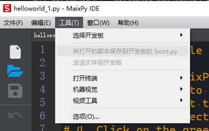
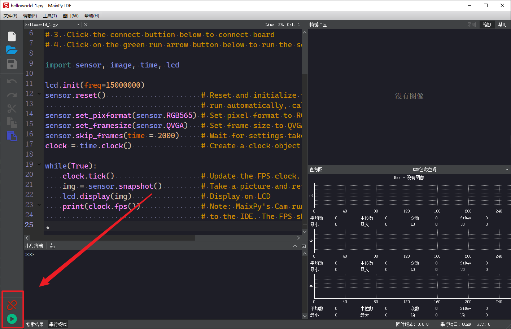

## MaixPy has a built-in file system

As mentioned earlier, `MaixPy` supports `SPIFFS` used by `Flash` (currently does not support directory creation), by default, `3MB` is allocated to `SPIFF` (from the address of `flash` `0xD00000`, `3M`), boot Automatically mount to the `/flash` directory

It also supports the `Micro SD (TF)` card of `FAT32` format `MBR` partition, and it will automatically hang under the `/sd` directory when booting up

It should be noted that the root directory is only used to mount the Flash or SD card, and the specific files are in the `/flash` or `/sd` directory

## Why need to edit and execute the file

In the previous experiment, we directly typed the code in the terminal to execute sentence by sentence. This is also simple and convenient. After we enter the command, it will execute immediately and get the returned result in time. This interactive method is called **`REPL (Read Eval Print Loop: Interactive interpreter) `**,
The advantage of this method is that it is simple and convenient. It is very similar to the Linux terminal, except that the syntax used is replaced by MaixPy (Micropython) syntax.

But in actual operation, we want the code to be saved in the file system, and we need to run the file directly, so that we don’t have to type the code every time, which reduces a lot of trouble.


## Edit and save the file

### Method 1: Use the built-in editor [Micropython Editor(pye)](https://github.com/robert-hh/Micropython-Editor)

In MaixPy, we have built-in an open source editor [Micropython Editor(pye)](https://github.com/robert-hh/Micropython-Editor)

Use `os.listdir()` to view the files in the current directory,

Use `pye("hello.py")` to create a file and enter the editing mode, and the instructions for using shortcut keys can be found in [here](https://github.com/robert-hh/Micropython-Editor/blob/master/Pyboard%20Editor.pdf)

For example, we write code

```python
print("hello maixpy")
```

Then press `Ctrl+S` and press `Enter` to save, press `Ctrl+Q` to exit editing

**Note**: The use of this editor has certain requirements for the serial tool used. The `BackSpace` key must be set to the `DEL` function, otherwise pressing `BackSpace` will call the same function as `Ctrl+H` ( That is character replacement).

It is recommended to use `minicom` under Linux, you need to use `sudo minicom -s` to set, refer to [previous tutorial](./env_serial_tools.md)

The same is true under Windows, search the setting method according to the tool you use, such as `xshell` search `xshell How to set backspace to del` to get the result:

`File` -> `Properties` -> `Terminal` -> `Keyboard`,

Change the sequence of delete and backspace to ASCII 127.


### Method 2: Use MaixPy IDE

Open `MaixPy IDE`, connect the development board

Edit the file, then in the top `Tool` menu, use the `send file` function in the top `Tool` menu to send the file, it will be saved to the development board and the file name is the same as the file name on the computer

Of course, you can also click `Save the opened file as boot.py` to save the code to the `boot.py` file of the development board. This file will be executed automatically next time the development board is powered on.





### Method Three: Use the tool [uPyLoader](https://github.com/BetaRavener/uPyLoader) to read to the PC (computer), edit and then save to the development board

Download the executable file: [release](https://github.com/BetaRavener/uPyLoader/releases)


Select the serial port and click the `Connect` button to connect to the board

The first time you run the software, you need to initialize. Click on `File->Init transfer files` to complete the initialization. This will create two files in the board, namely `__upload.py` and `__download.py`.

Then double-click the file name to open the file and edit it. After editing, click `save` to save to the development board.


### Method 4: Use the tool [rshell](https://github.com/dhylands/rshell) to read it on the PC (computer) and edit it and then save it to the development board

Follow the instructions of `rshell` [Project Homepage](https://github.com/dhylands/rshell) to install `rshell`

```shell
sudo apt-get install python3-pip
sudo pip3 install rshell
rshell -p /dev/ttyUSB1 # Here, choose the serial port according to the actual situation
```

Edit file

```python
ls /flash
edit /flash/boot.py
# The editor is used in the same way as vim
```

## executable file

Use `os.chdir()` to switch the current directory to the directory of the file, such as `os.chdir("/flash")`

### Method 1: `import`

Then execute `import hello`

You can see the output `hello maixpy`

Using this method is simple and easy to use, but it should be noted that currently `import` can only be used once. If the second `import`, the file will not be executed again. If you need to execute it multiple times, the following method is recommended
And `import` will not execute the code under the condition of `if __name__ == "__main__":`, you need to pay attention

### Method 2: `exec()`

Use the `exec()` function to execute

```python
with open("hello.py") as f:
    exec(f.read())
```

### Method 3: Use **MaixPy IDE** to execute

Open the file, and then click the execute button to execute it. **Note**: The execution code is similar to the `REPL` execution code, except that the program is sent to the development board and not saved to the file system. It is executed once



### Method 4: Use uPyLoader to execute

After connecting, select the file and click the `excute` button to execute the file


### Method 5: Use ampy to run files on the computer directly

[ampy](https://github.com/pycampers/ampy)

Execute the command `ampy run file_in_PC.py` to execute the file located on the computer (the file will not be saved to the development board)

## Does MaixPy support mounting file systems to the computer?

Not supported, because the chip k210 used has no USB function and cannot simulate a U disk device, so it cannot be a virtual U disk like Microbit and STM32 Micropython
