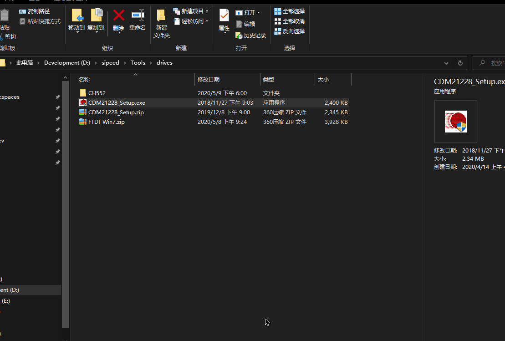

## 概述

  SIPEED **MaixAmigo** 可开发编程学习套件, MaixAmigo 在硬件上集成前后各 30W 像素摄像头、可扩展 TF 卡槽、用户按键、3.5‘TFT 寸显示屏、520mAh 锂电池、扬声器,麦克风、SPMOD,GROVE 扩展接口等。

  软件上 MaixAmigo 默认搭载 MaixPy, 用户可以非常轻松的使用 MicroPython 语法快速进行人脸识别、物体分类等多种 AIoT 开发，同时还预留开发调试接口，也能将其作为一款功能强大的 AI 学习开发板。

## 外观及功能介绍

### 外观一览


### 板载功能

| 项目               | 说明                                                             |
| ------------------ | ---------------------------------------------------------------- |
| CPU：              | 双核 64bit RISC-V / 400MHz* (双精度FPU集成)                      |
| 内存：             | 8MiB 64bit 片上 SRAM                                             |
| 存储：             | 16MiB Flash, 支持 micro SDXC 拓展存储 (最大128GB)                |
| 屏幕：             | 3.5寸 TFT 显示屏, 分辨率：320\*480, 支持电容触摸(FT6X36)         |
| 摄像头：           | OV7740 (后摄)与GC0328(前摄) 各 30W 像素(最大分辨率 VGA:640\*480) |
| 灯：              | 三颗单色 LED 灯，一颗闪光灯                                         |
| 电池：             | 板载可充电锂聚合物电池 (容量520mAh )                             |
| 板载扬声器与麦克风 | 集成单音频控制器 ES8374 1W 8Ω 扬声器                             |
| 板载接口：         | USB-C \*2 (K210 调试供电接口+兼容 STM32 核心板 USB 接口)         |
| 板载传感器:        | MSA301 三轴加速度传感器                                          |
| TF 卡槽：          | 多媒体资源扩展，支持大容量储存                                   |
| 电池:              | 520mAh 锂电池                                                    |

### 引脚资源


### 硬件板载扩展接口

MaixAmigo 对用户开放了两种高度扩展的接口：三个 [SP-MOD](./../modules/sp_mod/README.md) 与 三个 [Grove](./../modules/grove/README.md) 接口,用户可以很方便的进行 DIY。

### 板载 I2C 设备

MaixAmigo 板载 I2C 传感器/IC

| IC     | 设备 id     | I2C 地址(7位地址) | MaixPy 读取地址  | 示例代码 |
| ------ | ----------- | ----------------- | ---------------------------- |----|
| ES8374 | 0x08        | 0x10              | D(16)                        |[code](https://github.com/sipeed/MaixPy_scripts/blob/79a5485ec983e67bb8861305a52418b29e0dc205/modules/others/es8374/es8374.py)|
| MSA301 | 0x13        | 0x26              | D(38)                        |[code](https://github.com/sipeed/MaixPy_scripts/blob/7fea2359a7f0c05f586be915aa8e6112262e0caa/multimedia/gui/maixui/msa301.py)|
| AXP173 | 0x68        | 0x34              | D(52)                        |[code](https://github.com/sipeed/MaixPy_scripts/blob/7fea2359a7f0c05f586be915aa8e6112262e0caa/multimedia/gui/maixui/pmu_axp173.py)|


## 上手把玩

MaixAmigo 同样使用 MaixPy 入门 AIoT ，由于硬件特殊性，请在[配置 amigo 硬件](https://github.com/sipeed/MaixPy_scripts/blob/master/board/config_maix_amigo.py) 后再使用 MaixPy 。

而在开发之前我们需要了解并准备相关工具，以减少我们后边因为准备不足而走的坑路

上手步骤:

1. 下载需要的驱动，软件
2. 开发板连接电脑，并安装 USB 驱动
3. 更新最新固件
4. 下载并打开最新的 MaixPy IDE
5. MaixPy IDE 连接开发板 运行 MaixPy 示例程序

### 软硬件准备

硬件准备:

  - **电脑**一台
  - **MaixAmigo** 开发板
  - **可靠**的 USB Type-C 数据线一条：注意一定要**可靠**的数据线

软件准备:

  - USB 驱动：**FT2232** ->[[下载链接点这里](https://dl.sipeed.com/MAIX/tools/ftdi_vcp_driver)](https://dl.sipeed.com/MAIX/tools/ftdi_vcp_driver)
  - Kflash_gui：[https://dl.sipeed.com/MAIX/tools/kflash_gui](https://dl.sipeed.com/MAIX/tools/kflash_gui)
  - MaixPy IDE ：[https://dl.sipeed.com/MAIX/MaixPy/ide/_/v0.2.5](https://dl.sipeed.com/MAIX/MaixPy/ide/_/v0.2.5)
  - 例程程序库：[https://github.com/sipeed/MaixPy_scripts](https://github.com/sipeed/MaixPy_scripts)

###  安装驱动

我们在拿到 Maix Amigo 并连接到电脑的时候，可以打开设备管理器查看串口驱动是否已经安装，打开设备管理器的方法有:
- 此电脑(右键) -> 属性 -> 设备管理器
- 开始菜单(右键) -> 设备管理器
- 控制面板 -> (搜索)设备管理器

  

1. 当我们的系统是 Win10 系统，系统则会帮我们自动安装驱动，而如果是旧版 Win7，win8 系统我们就需要自己手动安装:
    

1. 打开上一节的的链接下载驱动
    
1. 点击安装
    
1. 安装完成之后，可以在设备管理器看到已经识别到两个串口设备了
    


### 更新固件到最新版

  用户拿到开发板之后，板载的固件默认或许已经不是最新版的，那么在使用过程中会存在或多或少的 bug，
  我们这时候就需要更新固件版本到最新版本

  更新方法查看：[更新固件](../get_started/upgrade_maixpy_firmware.md)

  **若使用 amigo 开发板，请烧录大于或等于 v0.6.2_12 版本的专用 amigo 固件（例如：maixpy_v0.6.2_12_gf18990aa3_amigo_tft(ips)_xxxx.bin），它与标准 maixpy 固件的差异在于其内置了 amigo 硬件的配置（config.json），并且屏幕类型分为 ips 和 tft ，烧录任意屏幕类型固件都是可以启动的，但不同屏幕的显示会不正常（正常的是红色的 maixpy 欢迎页），所以根据实际情况都可以烧录一遍确认。**


###  运行第一个程序 `Hello World`


- LCD 实时预览 Camera（使用 MaixPy IDE 连接时型号选择 Maixduino 即可）


```python
# -*- coding：UTF-8 -*-
import sensor, image, time, lcd
from fpioa_manager import fm

# -------------
lcd.init(freq=20000000)

while True:
    try:
        sensor.reset(choice=1)
        sensor.set_pixformat(sensor.YUV422)
        sensor.set_framesize(sensor.QVGA)
        sensor.skip_frames(time=2000)
        for i in range(100):
            img = sensor.snapshot()
            lcd.display(img)
    except Exception as e:
        print(e)

    try:
        sensor.reset(choice=2)
        sensor.set_pixformat(sensor.YUV422)
        sensor.set_framesize(sensor.QVGA)
        sensor.skip_frames(time=2000)
        for i in range(100):
            img = sensor.snapshot().rotation_corr(z_rotation = +90)
            lcd.display(img)

    except Exception as e:
        print(e)

```

## 资料下载

Maix-Amigo 资料下载：[Sipeed-Amigo](https://dl.sipeed.com/shareURL/MAIX/HDK/Sipeed-Amigo)

Maix-Amigo 规格书下载：[Sipeed-Amigo](https://dl.sipeed.com/shareURL/MAIX/HDK/Sipeed-Amigo/ProductSpecification)

Maix-Amigo IPS 版本 原理图下载：[Maix_Amigo_2970(Schematic).pdf][Maix_Amigo_2970(Schematic).pdf]

Maix-Amigo TFT 版本 原理图下载：[Maix_Amigo_2960(Schematic).pdf][Maix_Amigo_2960(Schematic).pdf]

[Maix_Amigo_2970(Schematic).pdf]: https://dl.sipeed.com/fileList/MAIX/HDK/Sipeed-Amigo/2970/Maix_Amigo_2970(Schematic).pdf
[Maix_Amigo_2960(Schematic).pdf]: https://dl.sipeed.com/fileList/MAIX/HDK/Sipeed-Amigo/2960/Maix_Amigo_2960(Schematic).pdf