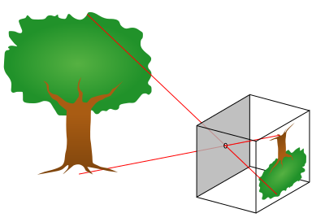

## 什么是摄像头？

我们都见过各种摄像头，比如

那么什么是摄像头，说到底，就是一个将光学信号转变成电信号的一个装置。在计算机视觉中，最简单的相机模型是`小孔成像模型`：

小孔模型是一种理想相机模型，没有考虑实际相机中存在的场曲、畸变等问题。但是在实际使用时，这些问题可以通过在标定的过程中引入`畸变参数`解决，所以小孔模型仍然是目前最广泛使用的相机模型。

图像透过镜头，照在一个感光芯片上，感光芯片可以把光照的波长和强度等信息转成计算机(数字电路)可以识别的数字信号，`感光元件`是长这样的：

(中间的方形元件就是感光元件)

## 什么是像素和分辨率？

感光元件是有很多个感光点构成的，比如有 `640` x `480` 个点，每个点就是一个像素，把每个点的像素收集整理起来，就是一副图片，那么这张图片的分辨率就是 640x480：

## 什么是帧率

帧率(FPS)就是每秒钟处理的图片数量，如果超过20帧，人眼就基本分辨不出卡顿。当然，如果用在机器上，帧率越高越好。

## 什么是颜色

物理上，颜色就是不同波长的电磁波。

|颜色|频率       |波长|
| --- | --- | --- |
|紫色|668–789 THz|380–450 nm|
|蓝色|631–668 THz|450–475 nm|
|青色|606–630 THz|476–495 nm|
|绿色|526–606 THz|495–570 nm|
|黄色|508–526 THz|570–590 nm|
|橙色|484–508 THz|590–620 nm|
|红色|400–484 THz|620–750 nm|

但是，根据人眼的视觉效果，可以通过 RGB，CMYK，HSB，LAB 色域，来将可见光的颜色描述出来。

## RGB 三原色

三原色的原理不是物理原因，而是由于人的生理原因造成的。人的眼睛内有几种辨别颜色的锥形感光细胞，分别对黄绿色、绿色和蓝紫色(或称紫罗兰色)的光最敏感(波长分别为564、534和420纳米)。

所以 RGB 经常用于显示器上，用来显示图片。

- LAB 亮度-对比度
Lab颜色空间中，L亮度；a的正数代表红色，负端代表绿色；b的正数代表黄色，负端代表兰色。不像RGB色彩空间，Lab颜色被设计来接近人类视觉。

因此L分量可以调整亮度对，修改a和b分量的输出色阶来做精确的颜色平衡。

注意：在MaixPy的查找色块的算法中，运用的就是这个LAB模式！

- 光源的选择

如果你的机器是在工业上，或者24小时长时间运行的设备，保持一个稳定的光源是至关重要的，尤其在颜色算法中。亮度一变，整个颜色的值会变化的很大！

## 镜头的焦距

因为图像是通过镜头的光学折射，照到感光元件上的。那么镜头就决定了，整个画面的大小和远近。一个最重要的参数就是焦距。

**镜头焦距**：是指镜头光学后主点到焦点的距离，是镜头的重要性能指标。镜头焦距的长短决定着拍摄的成像大小，视场角大小，景深大小和画面的透视强弱。当对同一距离远的同一个被摄目标拍摄时，镜头焦距长的所成的象大，镜头焦距短的所成的象小。注意焦距越长，视角越小。

还有一点是镜头的畸变，因为光学原理，在感光芯片上不同的位置，与镜头的距离不同的，简单说就是近大远小，所以在边缘会出现鱼眼效果(桶型畸变)。为了解决这个问题，可以在代码中使用算法来矫正畸变，注：MaixPy中使用image.lens_corr(1.8)来矫正2.8mm焦距的镜头。也可以直接使用无畸变镜头。无畸变镜头加入了额外的矫正透镜部分，价格自然会高不少。

## 镜头的滤片

在镜头上，通常会有一个滤片。

这个滤片是做什么的呢？

我们知道，不同颜色的光，是波长不一样。在正常环境中，除了可见光，还有很多红外光，在夜视中，用的就是红外光。

但是，在正常颜色应用中，是不需要红外光的，因为红外光也会使感光元件受到反应，就使得整个画面泛白。所以我们在镜头上放一个只能通过波长 650nm 以内的滤光片，将红外光进行过滤。