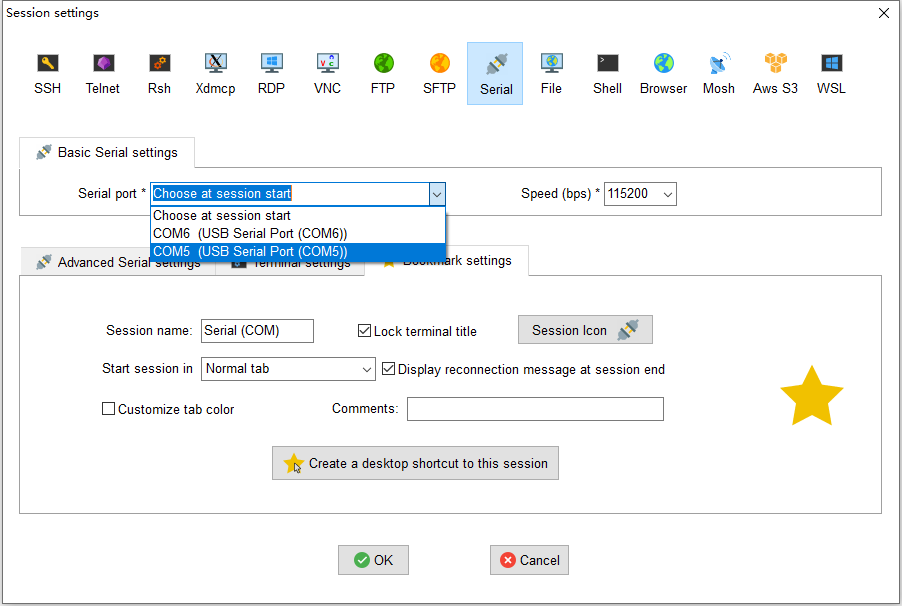
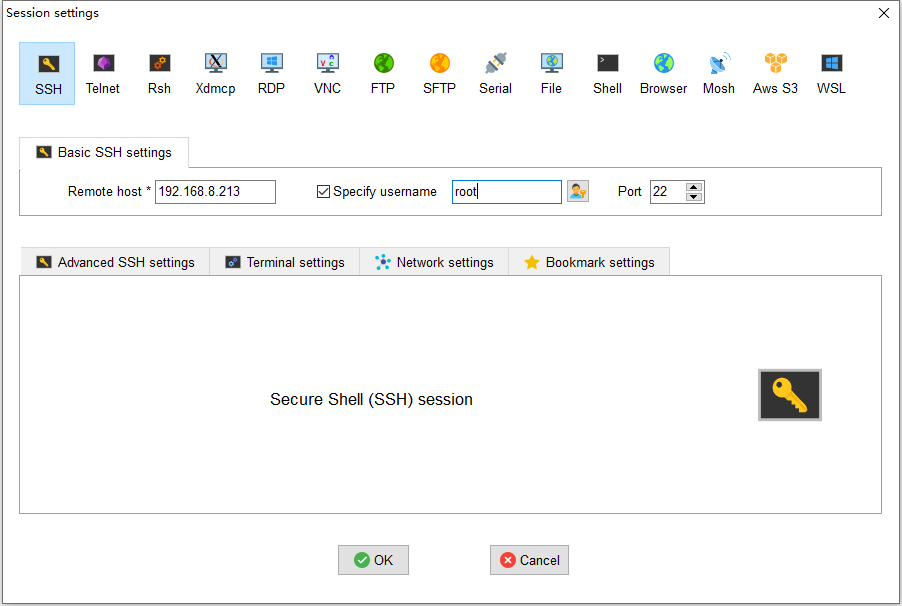
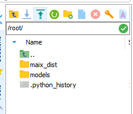

## 什么是MobaXterm

MobaXterm是一款近乎全功能的终端工具，它支持SSH,FTP，VNC，串口等功能，并且界面也十分美观，使用起来相当的顺手。

## MobaXterm的安装

下载地址：https://mobaxterm.mobatek.net/download.html
下载免费版就好，有portable版本和Installer版本可选，portable版本无需安装，后者需要安装。根据自己需要随意选择即可，安装一路Next即可。

## MobaXterm串口使用

第一次使用需要先创建会话，点击界面左上角的session，类型选择Serial，配置如下：



这里需要修改的只有波特率和串口号，其他的保持默认即可。串口号根据Dock的串口来选择，一般来说安装好驱动之后会出现两个串口，选择串口号比较小的那个即可。点击ok即可进入终端界面，如果没反应的话可以敲一次回车，即可看到终端界面。

## wifi配置

在连接ssh之前我们需要给开发板连上网络。

```
root@sipeed:~# vim /etc/wpa_supplicant.conf
```

修改里面的ssid为要连接的wifi名称，psk为连接的wifi密码。注意只能使用2.4G频段的wifi，开发板不支持5G频段的wifi。然后重启开发板即可连接上网络。

在终端输入ifconfig可以看到wlan0出现ip地址，网络连接成功。

## ssh使用

串口使用固然很方便，但是很多时候我们的设备并没有直接和电脑连接在一起，而是连接在同一个局域网下。此时可以通过网络来远程控制开发板。

同样点击主界面左上角的session，选择ssh。Remote Host选择之前ifconfig查看到的远程主机的ip地址。勾选Sepecify Username，账号输入root。配置如下：



随后输入默认密码：123 。即可远程登录进开发板。

## 文件传输

MobaXterm终端集成了SFTP工具，可以直接通过终端左端的upload按钮将文件从PC端传输至开发板。

